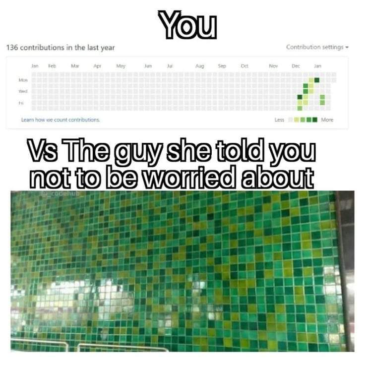

<!--
**Matheovi/Matheovi** is a ✨ _special_ ✨ repository because its `README.md` (this file) appears on your GitHub profile.

Here are some ideas to get you started:

- 🔭 I’m currently working on ...
- 🌱 I’m currently learning ...
- 👯 I’m looking to collaborate on ...
- 🤔 I’m looking for help with ...
- 💬 Ask me about ...
- 📫 How to reach me: ...
- 😄 Pronouns: ...
- ⚡ Fun fact: ...
-->
# Mateusz Wiatrok

**🧰 Languages and tools I've used:**

 
          

          

          

 
 

#

<h3>My Coding Journey</h3>

   I started my coding journey as a curious teenager, that wanted to do "magic" with computers. I've started learning c++ at that time, and was playing with all kinds of computers hacking related stuff: game hacks and exploits, game bugs, cheat engine, code disassembly but without success due to huge amount of knowledge needed to understand it fully. Then I've become a computer science student. During that time I've licked many technologies, and understood basics of computer science. During that time I was doing many computer programs and projects required for passing the subjects. I was doing hobby weekend projects too when I had a time. These included Arduino devices, Python flashcards game, flashcards nodejs website, minecraft mod, coding challanges, udemy courses. I love tinkering with Linux operation systems and learning about how to use command line efficiently in daily tasks. I prefer low level programming languages, because of huge degree of freedom these languages offer. I'm also interested in cybersecurity, and how hackers can attack a device or a system, After graduation, I've started to think about possible career paths for me...

#

<h3>Channels That I Like to watch</h3>

* https://www.youtube.com/c/TsodingDaily - Good C, C++, Rust programmer
* https://www.youtube.com/c/beneater - Low level stuff, bits and bytes, building computers on breadboards
* https://www.youtube.com/@javidx9 - C++ programming
* https://www.youtube.com/@greatscottlab - Analog & Digital Electronics projects

#

<h3> I love good memes </h3>

